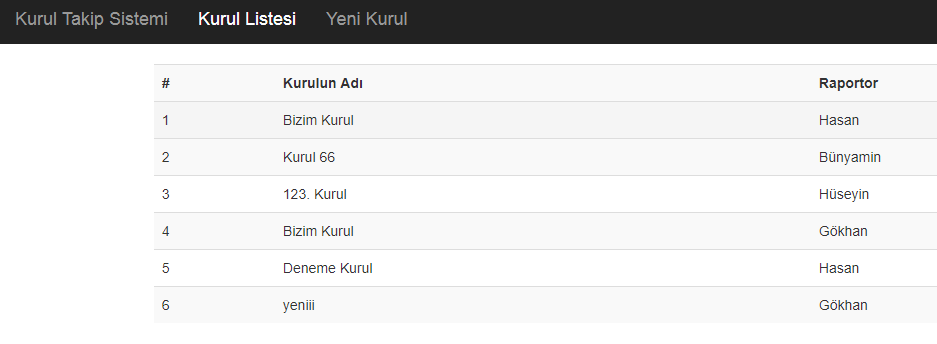
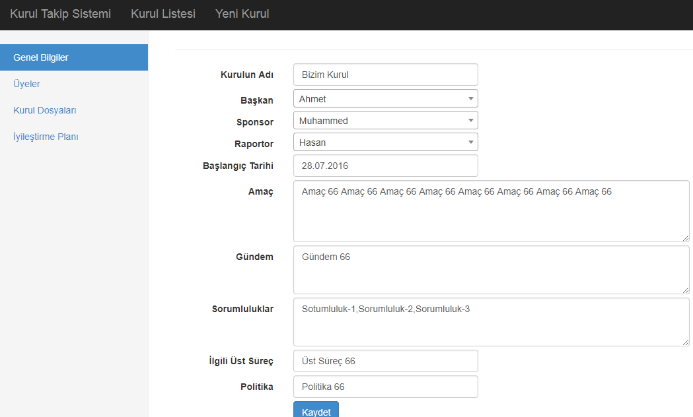

# Kurul Takip Sitesi

- Yeni kurul oluşturulması ve mevcutların takibinin yapılması.
- Üye, dosya ve planların düzenlenmesi yapılabilir.

## Kurulum

- Database Model Entities çalışması için App_Data klasörü altında bulunan "script.sql" script'in çalıştırılıp local MS-SQL Server'a bağlanması gerekmektedir.

## Sitenin Bazı Sayfaları

